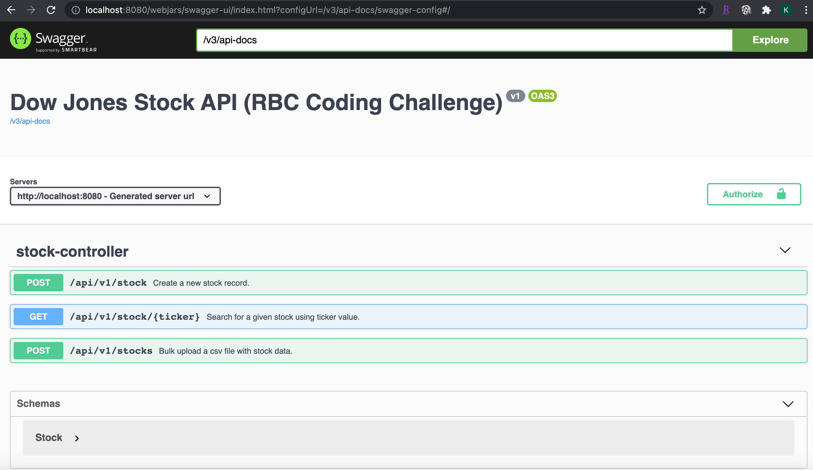

# Dow Jones Stocks App (RBC Coding Challenge)

[](https://github.com/kissenlall/dow-jones-stocks/actions/workflows/maven.yml)

##Requirements

- upload a bulk data set
- find stock using its ticker
- insert new record

##Technologies used

- spring boot
- spring webflux
- spring jpa
- test containers
- docker, docker compose
- open api/swagger ui

##Assumptions

- uniqueness of stock record by ticker and date (bulk upload)
- save or update (insert new record)

##Build and Run Application

The application can be built using maven command below and also generate a local
docker image. The jib maven plugin is being used here and the command is being
run from the root of the application folder.

```
mvn clean install jib:dockerBuild
```

The application can then be run using the following docker compose command. This 
command also assumes you are at the root folder of the application.

```
docker-compose -f ./src/main/docker/app.yml up
```

##Endpoints

The endpoints can be viewed using the following swagger ui url once the application is
running. The endpoints can also be tried out.

```
http://localhost:8080/swagger-ui.html
```





##Notes

The application is configured with basic auth with the user name and password as follows:

```
spring.security.user.name=username
spring.security.user.password=password
```

##Improvements

- more robust security
- additional tests especially on the reactive pieces of the code
- microservices approach to separate the bulk upload from the rest of the application
- using spring batch for the bulk upload to better track progress


